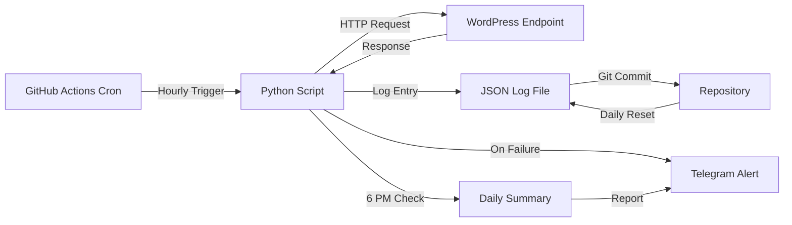

# WP Cron Checker

> Automated WordPress cron health monitoring with real-time Telegram alerts and daily reports

[](https://github.com/features/actions)
[](https://www.python.org/)
[](LICENSE.md)

## Overview

WP-Cron is WordPress's built-in task scheduler, handling critical operations like scheduled posts, email notifications, plugin updates, and automated backups. When WP-Cron fails, these essential tasks silently break—often without any warning.

**WP Cron Checker** solves this by providing:

- ⏰ **Automated hourly health checks** via GitHub Actions
- 🚨 **Instant Telegram alerts** when issues are detected
- 📊 **Daily summary reports** with uptime statistics
- 📝 **JSON logging** for audit trails and historical analysis
- 🌍 **Timezone-aware scheduling** optimized for East African Time (UTC+3)

The system runs Monday through Saturday, 9 AM to 6 PM EAT, ensuring your WordPress site's scheduled tasks remain reliable without manual intervention.

---

## Table of Contents

- [Features](#features)
- [How It Works](#how-it-works)
- [Prerequisites](#prerequisites)
- [Installation](#installation)
- [Configuration](#configuration)
- [Usage](#usage)
- [GitHub Actions Workflow](#github-actions-workflow)
- [Python Script Details](#python-script-details)
- [Telegram Notifications](#telegram-notifications)
- [Log File Structure](#log-file-structure)
- [Security Considerations](#security-considerations)
- [Troubleshooting](#troubleshooting)
- [Future Enhancements](#future-enhancements)
- [Contributing](#contributing)
- [License](#license)

---

## Features

### 🔍 Monitoring

- **Hourly health checks** of WordPress cron status
- **HTTP endpoint monitoring** via `/wp-json/site-monitor/v1/cron-status`
- **Delay detection** alerts when cron is more than 1 hour behind schedule
- **Error tracking** for HTTP failures, timeouts, and exceptions

### 🔔 Alerting

- **Real-time Telegram notifications** for immediate issue awareness
- **Markdown-formatted alerts** with full error context
- **Daily summary reports** at 6 PM EAT with:
  - Success/failure counts
  - Uptime percentage
  - Recent check history
  - Missed check warnings

### 📊 Logging

- **JSON-based logging** for structured data storage
- **Automatic log rotation** (daily reset after summary)
- **Timezone-aware timestamps** in EAT
- **Detailed failure context** including HTTP status codes and error messages

### ⚙️ Automation

- **Zero manual intervention** required after setup
- **Smart time detection** for final daily run
- **Git-integrated logs** with automatic commits
- **Concurrent-safe** operation with pull-before-push

---

## How It Works



### Workflow Sequence

1. **Trigger**: GitHub Actions runs on schedule (hourly, Mon-Sat, 9 AM-6 PM EAT)
2. **Check**: Python script pings WordPress cron status endpoint
3. **Log**: Result recorded in `logs/cron_checks.json` with timestamp and details
4. **Alert**: If failure detected (non-6 PM runs), immediate Telegram notification sent
5. **Summary**: At 6 PM, full daily report generated with statistics
6. **Commit**: Logs pushed to repository for persistence
7. **Reset**: After 6 PM summary, log file cleared for next day

---

## Prerequisites

### Required

- **WordPress site** with REST API enabled
- **Site Monitor plugin** (or custom endpoint) providing cron status at `/wp-json/site-monitor/v1/cron-status`
- **GitHub account** with Actions enabled (free tier sufficient)
- **Telegram account** with:
  - Bot created via [@BotFather](https://t.me/BotFather)
  - Chat ID obtained from [@userinfobot](https://t.me/userinfobot)

### Optional

- GitHub CLI (`gh`) for streamlined setup
- Local Python 3.x environment for testing

---

## Installation

### 1. Create Repository

```bash
# Using GitHub CLI
gh repo create kipmyk/wp-cron-checker --public --clone

# Or via Git
git clone https://github.com/kipmyk/wp-cron-checker.git
cd wp-cron-checker
```

### 2. Add Project Files

Create the following directory structure:

```
wp-cron-checker/
├── .github/
│   └── workflows/
│       └── check-wp-cron-health.yml
├── logs/
│   └── .gitkeep
├── check_wp_cron.py
├── requirements.txt
├── README.md
└── .gitignore
```

### 3. Create `.gitignore`

```
__pycache__/
*.pyc
.env
.DS_Store
```

### 4. Create `requirements.txt`

```
requests>=2.31.0
```

### 5. Push to GitHub

```bash
git add .
git commit -m "Initial commit: WP Cron Checker setup"
git push origin main
```

---

## Configuration

### GitHub Secrets

Navigate to **Settings → Secrets and variables → Actions → New repository secret**

Add the following secrets:

| Secret Name | Description | Example |
|------------|-------------|---------|
| `WP_SITE_URL` | Your WordPress site URL (no trailing slash) | `https://mike.co.ke` |
| `TELEGRAM_BOT_TOKEN` | Bot token from @BotFather | `123456789:ABCdefGHIjklMNOpqrsTUVwxyz` |
| `TELEGRAM_CHAT_ID` | Your personal chat ID from @userinfobot | `987654321` |

### WordPress Endpoint Setup

Ensure your WordPress site has a cron status endpoint at:

```
https://your-site.com/wp-json/site-monitor/v1/cron-status
```

Expected JSON response format:

```json
{
  "cron_enabled": true,
  "next_run": 1698480000,
  "current_time": 1698483600,
  "delay_seconds": 3600
}
```

## Usage

### Manual Trigger

Test the workflow manually:

1. Go to **Actions** tab in your repository
2. Select **"Check WP Cron Health"** workflow
3. Click **"Run workflow"**
4. Monitor the run logs for output

### Automated Schedule

The workflow runs automatically:

- **Days**: Monday through Saturday (no Sunday runs)
- **Hours**: 9 AM to 6 PM EAT (6 AM to 3 PM UTC)
- **Frequency**: Every hour on the hour
- **Total runs**: 10 checks per day

### Testing Locally

```bash
# Set environment variables
export WP_SITE_URL="https://your-site.com"
export TELEGRAM_BOT_TOKEN="your-bot-token"
export TELEGRAM_CHAT_ID="your-chat-id"
export IS_LAST_RUN="false"

# Install dependencies
pip install -r requirements.txt

# Run script
python check_wp_cron.py
```

---

## GitHub Actions Workflow

### Complete Workflow File

Location: `.github/workflows/check-wp-cron-health.yml`

```yaml
name: Check WP Cron Health

permissions:
  contents: write

on:
  schedule:
    # Monday to Saturday (1-6) | 9 AM-6 PM EAT (6 AM-15 UTC)
    - cron: '0 6 * * 1-6'   # 9 AM EAT
    - cron: '0 7 * * 1-6'   # 10 AM EAT
    - cron: '0 8 * * 1-6'   # 11 AM EAT
    - cron: '0 9 * * 1-6'   # 12 PM EAT
    - cron: '0 10 * * 1-6'  # 1 PM EAT
    - cron: '0 11 * * 1-6'  # 2 PM EAT
    - cron: '0 12 * * 1-6'  # 3 PM EAT
    - cron: '0 13 * * 1-6'  # 4 PM EAT
    - cron: '0 14 * * 1-6'  # 5 PM EAT
    - cron: '0 15 * * 1-6'  # 6 PM EAT (final daily summary)
  workflow_dispatch:

jobs:
  cron-health:
    runs-on: ubuntu-latest

    steps:
      - name: Checkout repository
        uses: actions/checkout@v4

      - name: Set up Python
        uses: actions/setup-python@v5
        with:
          python-version: '3.x'

      - name: Install dependencies
        run: pip install -r requirements.txt

      - name: Create logs directory
        run: mkdir -p logs

      - name: Pull latest logs from repo
        run: |
          git pull origin main || echo "Nothing to pull"
          if [ ! -f logs/cron_checks.json ]; then
            echo "[]" > logs/cron_checks.json
            echo "Created empty log file"
          fi

      - name: Determine if last run of the day
        id: check_time
        run: |
          CURRENT_HOUR=$(date -u +%H)
          CURRENT_MIN=$(date -u +%M)
          echo "UTC Hour=${CURRENT_HOUR}, Min=${CURRENT_MIN}"
          if [ "$CURRENT_HOUR" == "15" ] && [ "$CURRENT_MIN" -le 30 ]; then
            echo "is_last_run=true" >> $GITHUB_OUTPUT
            echo "Detected as last run of the day"
          else
            echo "is_last_run=false" >> $GITHUB_OUTPUT
          fi

      - name: Run WP Cron Health Check
        env:
          WP_SITE_URL: ${{ secrets.WP_SITE_URL }}
          TELEGRAM_BOT_TOKEN: ${{ secrets.TELEGRAM_BOT_TOKEN }}
          TELEGRAM_CHAT_ID: ${{ secrets.TELEGRAM_CHAT_ID }}
          IS_LAST_RUN: ${{ steps.check_time.outputs.is_last_run }}
        run: python check_wp_cron.py

      - name: Commit and push logs
        run: |
          git config --local user.email "github-actions[bot]@users.noreply.github.com"
          git config --local user.name "github-actions[bot]"
          git add logs/cron_checks.json
          if git diff --staged --quiet; then
            echo "No changes to commit"
          else
            git commit -m "Update cron check logs [skip ci]"
            git push
          fi
        continue-on-error: true

      - name: Clean up logs after summary
        if: steps.check_time.outputs.is_last_run == 'true'
        run: |
          echo "[]" > logs/cron_checks.json
          echo "Logs reset for next day"
          git add logs/cron_checks.json
          git commit -m "Reset cron check logs [skip ci]" || echo "No changes"
          git push || echo "Push failed"
```

### Key Workflow Features

- **Permissions**: `contents: write` allows log commits
- **Time Detection**: Identifies 6 PM run via UTC hour check (15:00-15:30 UTC)
- **Concurrent Safety**: Pulls latest logs before running
- **Commit Messages**: `[skip ci]` prevents recursive workflow triggers
- **Error Handling**: `continue-on-error: true` prevents workflow failures

---

## Python Script Details

### Core Functions

```python
def get_eat_time():
    """Returns current time in EAT (UTC+3)."""
    eat_tz = timezone(timedelta(hours=3))
    return datetime.now(eat_tz)

def check_wp_cron(is_last_run):
    """Main check logic with timeout handling."""
    # Makes HTTP request to WordPress endpoint
    # Logs success/failure with timestamp
    # Sends Telegram alert on failure (non-last-run only)

def send_daily_summary():
    """Generates and sends comprehensive daily report."""
    # Calculates uptime percentage
    # Lists recent checks
    # Warns about missed checks
    # Formats as Markdown
```

### Error Handling

The script handles:

- **HTTP errors** (4xx, 5xx status codes)
- **Network timeouts** (10-second limit)
- **JSON parsing errors**
- **Missing environment variables**
- **File I/O exceptions**

### Exit Codes

- `0`: Success or recoverable failure
- `1`: Critical error (missing env vars, file issues)

---

## Telegram Notifications

### Failure Alert Example

```
🚨 WP-Cron Health Check Failed

🌐 Site: mike.co.ke
⏰ Time: 2025-10-28 02:45:30 PM EAT

❌ Issue Detected:
Cron delayed by 1h 15m (threshold: 1h)

🔧 Action Required:
Check WordPress admin → Tools → Site Health
```

### Daily Summary Example

```
📊 Daily WP-Cron Report

🌐 Site: mike.co.ke
📅 Date: October 28, 2025
⏰ Report Time: 06:00:00 PM EAT

Summary:
✅ Successful Checks: 9/10
❌ Failed Checks: 1/10
📈 Uptime: 90.0%

Recent Health Checks:
• 03:00:12 PM - Delay: 45s ✓
• 04:00:08 PM - Delay: 1h 5m ✗
• 05:00:05 PM - Delay: 12s ✓
• 06:00:00 PM - Delay: 8s ✓

⚠️ Attention Needed: 1 failed check today
```

### Telegram Markdown Features

- **Bold headers** for quick scanning
- **Emoji indicators** for visual status
- **Monospace site URLs** for clarity
- **Bullet lists** for check history

---

## Log File Structure

### Location

`logs/cron_checks.json`

### Format

```json
[
  {
    "timestamp": "2025-10-28 09:00:15 AM EAT",
    "status": "success",
    "delay_seconds": 45,
    "response_time_ms": 234
  },
  {
    "timestamp": "2025-10-28 10:00:08 AM EAT",
    "status": "failure",
    "error": "HTTP 503: Service Unavailable",
    "delay_seconds": null
  }
]
```

### Fields

- `timestamp`: EAT-formatted datetime
- `status`: `"success"` or `"failure"`
- `delay_seconds`: Cron delay (null if check failed)
- `response_time_ms`: API response time (success only)
- `error`: Error description (failure only)

### Lifecycle

1. **Initialization**: Created as empty array `[]` if missing
2. **Hourly Append**: New entry added after each check
3. **Daily Reset**: Emptied after 6 PM summary
4. **Git Tracking**: Committed after each check and after reset

---

## Security Considerations

### Best Practices

✅ **All credentials stored as GitHub Secrets** (never in code)  
✅ **HTTPS-only** for WordPress endpoint  
✅ **No sensitive data** logged (no passwords, tokens)  
✅ **Bot privacy mode** enabled in Telegram  
✅ **Read-only WordPress endpoint** (no write operations)  
✅ **Repository permissions** limited to necessary scopes  

### Additional Hardening

- Use **2FA on GitHub** account
- Restrict **bot to private chat** (disable group forwarding)
- Enable **WordPress firewall** (e.g., Cloudflare, Wordfence)
- Audit **GitHub Actions logs** periodically
- Consider **encrypting log file** for compliance scenarios

---

## Troubleshooting

### Common Issues

#### ❌ "Logs not updating in repository"

**Cause**: Git permissions or merge conflicts

**Solution**:
```bash
# Check workflow permissions
# Settings → Actions → General → Workflow permissions → Read and write

# Manually resolve conflicts
git pull origin main
git add logs/cron_checks.json
git commit -m "Resolve log conflicts"
git push
```

#### ❌ "Telegram messages not received"

**Cause**: Invalid bot token or chat ID

**Solution**:
```bash
# Test bot token
curl "https://api.telegram.org/bot<YOUR_TOKEN>/getMe"

# Verify chat ID
# Send message to bot, then check:
curl "https://api.telegram.org/bot<YOUR_TOKEN>/getUpdates"
```

#### ❌ "WordPress endpoint returning 404"

**Cause**: Site Monitor plugin not installed/activated

**Solution**:
1. Install Site Monitor plugin from WordPress.org
2. Activate plugin
3. Test endpoint: `curl https://your-site.com/wp-json/site-monitor/v1/cron-status`

#### ❌ "Daily summary not sent"

**Cause**: Time detection mismatch

**Solution**:
```python
# Add debug logging to check_wp_cron.py
print(f"UTC Hour: {get_utc_now().hour}")
print(f"Is Last Run: {is_last_run}")
```

---

## Future Enhancements

### Planned Features

- [ ] **Multi-site monitoring** (array of WordPress URLs)
- [ ] **Response time tracking** (graphs in Telegram)
- [ ] **Weekly aggregated reports** via email
- [ ] **Slack integration** as alternative to Telegram
- [ ] **Custom alert thresholds** (configurable delay tolerance)
- [ ] **Historical analytics** (monthly uptime trends)
- [ ] **Downtime cost calculator** (business impact metrics)
- [ ] **Integration testing** (mock WordPress responses)

### Community Requests

Have a feature idea? [Open an issue](https://github.com/kipmyk/wp-cron-checker/issues) with the `enhancement` label.

---

## Contributing

Contributions are welcome! Please follow these steps:

1. **Fork the repository**
2. **Create a feature branch** (`git checkout -b feature/amazing-feature`)
3. **Commit your changes** (`git commit -m 'Add amazing feature'`)
4. **Push to branch** (`git push origin feature/amazing-feature`)
5. **Open a Pull Request**

### Code Style

- Follow [PEP 8](https://peps.python.org/pep-0008/) for Python
- Use meaningful variable names
- Add docstrings to functions
- Include comments for complex logic

---

## License

This project is licensed under the **MIT License** - see the [LICENSE](LICENSE) file for details.

---

## Acknowledgments

- **WordPress Core Team** for WP-Cron architecture
- **Telegram Bot API** for notification infrastructure
- **GitHub Actions** for free automation
- **Open Source Community** for inspiration

---

## Support

- 📖 **Documentation**: [GitHub Wiki](https://github.com/kipmyk/wpcron-checker/wiki)
- 🐛 **Bug Reports**: [Issues](https://github.com/kipmyk/wpcron-checker/issues)
- 💬 **Discussions**: [GitHub Discussions](https://github.com/kipmyk/wpcron-cheaker/discussions)
- 📧 **Email**: e@kipmyk.co.ke

---

## Author

**Kipmyk**  
Automating WordPress reliability with open-source tools.

[GitHub](https://github.com/kipmyk) • [Website](https://mike.co.ke)

---
